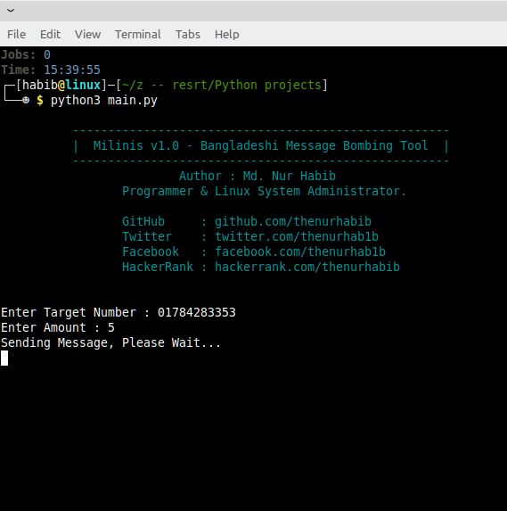

##  Milinis - Bangladeshi Message Bombing Tool.
<hr>

### Milinis is a Python based SMS Bombing script. It's allows You to Bomb on Any Bangladeshi Number Without Any Limitation.

<br><br>

### Login Information 

```yaml
[No Login Required.]
```

<br>

` Disclaimer  : This tool made for only educational purpose please don't use it for any bad purpose.`

<br>

## Usage.

### For Linux Users
```yaml
 apt-get update
 apt-get upgrade
 sudo apt install git
 apt install python3
 pip3 install requests
 git clone https://github.com/thenurhabib/milinis
 cd milinis
 python3 milinis.py

```
<br>

### For Android (Terux) Users
```yaml
 pkg update
 pkg upgrade
 pkg install git
 pkg install python3
 pip install requests
 git clone https://github.com/thenurhabib/milinis
 cd milinis
 python milinis.py

```


## Screenshot




## 🔗 Links

[](https://www.nurhabib.ml/)
[](https://twitter.com/mdnurhabib)
[](https://hackerrank.com/thenurhabib)

## 🚀 About Me
I'm a programmer and Linux System Administrator.


## Author

```yaml
GitHub     : https://github.com/thenurhabib
Facebook   : https://web.facebook.com?thenurhab1b 
HackerRank : https://www.hackerrank.com/thenurhabib
```
<br>


# <strong> <center> Thank You. </center> <strong>
